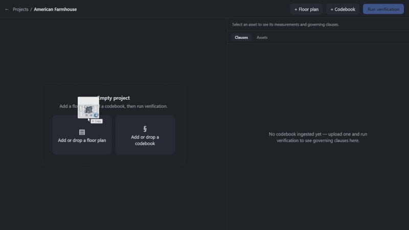
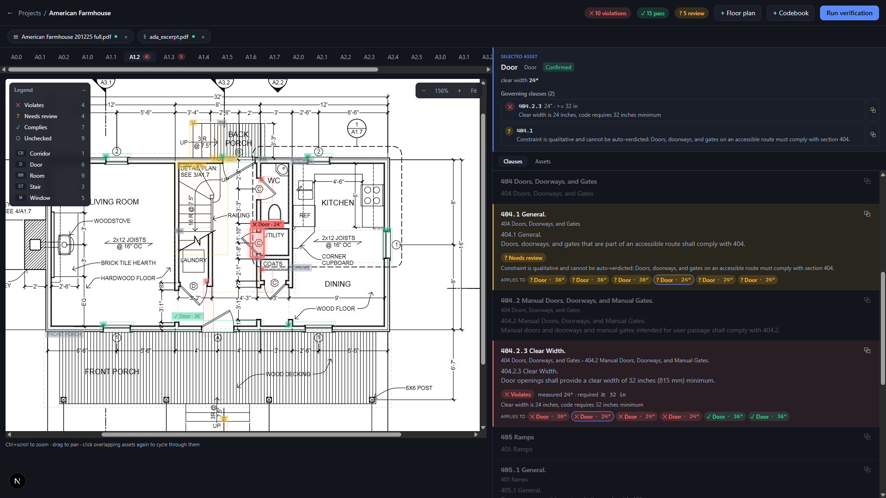

# PlanLint

**A compliance linter for building drawings — that refuses to guess.** PlanLint
reads floor-plan PDFs to find the physical objects, reads codebook PDFs to find
the legal constraints, and verifies one against the other — writing every verdict
as a deterministic, auditable edge in a Neo4j graph:

```
(:PhysicalAsset {id: "D2", type: "door"})
    -[:VIOLATES {measured: 30, required: ">= 32 in",
                 reason: "clear_width is 30 inches, code requires 32 inches minimum"}]->
(:Regulation {clause: "ADA 404.2.3"})
```



A dual-pane viewer renders the plan with green / red / amber overlays; click a red
box and the exact failing clause scrolls into view beside it.

---

## The one commitment: no LLM ever decides compliance

This is the reason to use PlanLint over a "just ask GPT if this plan is compliant"
prototype.

> **LLMs extract *structure only*. A pure-Python checker is the sole verdict
> authority. Every magnitude is grounded in geometry or printed text before it can
> enter a verdict.**

- The vision model **classifies** entities and reads printed tags — never a *measurement*.
- Every number that reaches a verdict is **grounded**: snapped vector geometry, a
  validated dimension line, or a schedule table — never the model's imagination.
- `verify/checker.py` — plain Python — is the only place a verdict is decided.

So every verdict is a graph edge carrying the measured value, the required value,
the clause, and the run id: queryable, diffable across revisions, traceable to a
pixel. A confident wrong answer is the worst failure mode for code review — PlanLint
is built so it structurally cannot produce one.

---

## What it is — and is not

**It is** an AEC (architecture / engineering / construction) compliance *linter*: it
checks measurable facts on a plan against measurable code requirements and shows its
work — flagging what it can prove, leaving the rest for a human.

**It is not** a substitute for a licensed professional's judgment or an authority's
approval, and it does not certify a building as compliant. A `COMPLIES_WITH` edge
means *one measurable clause checked out for one measured asset* — nothing more.

---

## Honesty is the feature

Stronger at refusing to lie than at measuring everything — the right trade for
compliance: a missed check a human can catch beats a fabricated "pass" a human trusts.

**✅ Works well**
- Deterministic, reproducible verdicts — each a queryable graph edge with provenance.
- Openings joined to their door/window **schedule** size by plan callout.
- Openings grounded in real CAD geometry (snapped wall gaps, validated dimension lines).
- **Cross-sheet linking** — an asset's callouts (`1/A3.0`) resolve to the detail/section that draws it, and dimensions are harvested back onto the asset.
- Says "I don't know" correctly — missing scale or a qualitative clause → `NEEDS_REVIEW`.

**🟠 Returns NEEDS_REVIEW by design**
- Rooms dimensioned as *chained* strings (`6'-6" + 5'-6" …`) — chained-sum isn't supported yet (top of the roadmap).
- Anything with no detected drawing scale.
- Qualitative clauses ("adequate", "as required by the AHJ").

**⚠️ Known limits**
- Schedule sizes are nominal, not true clear width (a 36" leaf ≈ 34" clear).
- Raster / scanned plans are the weakest path (OpenCV masks + OCR, no dimension grid).
- VLM classification miscounts / misclassifies — a stronger vision model helps.
- Feet-only callouts (`9'`, no inch mark) aren't parsed yet.
- Generalization is unproven — validated on one real multi-sheet set plus synthetic fixtures.

Judge it on the *discipline* — the extraction↔verdict seam, the grounding, the honest
`NEEDS_REVIEW` — not a raw accuracy number. The accuracy will climb; the discipline is
the design.

---

## Architecture

A staged pipeline (`verify/pipeline.py`), each page and asset isolated so one bad
input never aborts a run:

```
 floor plan PDF ──► spatial ingestion ──► (:PhysicalAsset) ─┐
   PyMuPDF vector geometry + OpenCV raster masks,           │   4-stage verification
   VLM classifies, geometry/schedules measure               ├─► Code Hunter    (vector search + clause ancestry)
                                                             │   Rule Extractor (LLM → typed Constraint, validated)
 codebook PDF ───► semantic ingestion ───► (:Regulation) ───┘   Checker        (pure Python — the sole verdict)
   LLM-first transcription / Docling, clause                    Compiler       (Cypher MERGE, idempotent per run)
   hierarchy preserved, embeddings in Neo4j
```

Spatial ingestion turns a multi-sheet set into grounded `PhysicalAsset` nodes — and
links each to the details and schedules that describe it; semantic ingestion turns a
codebook into a `Regulation` clause tree; the pure-Python checker compares the two.
Extracted constraints are cached as graph nodes — **the graph is the cache** — so
re-verifying an unchanged codebook re-runs zero extractions.

**Full module-by-module tour — grounding rules, provenance tiers, the graph schema →
[`ARCHITECTURE.md`](ARCHITECTURE.md).**

---

## Quickstart (5 minutes)

```bash
git clone https://github.com/luckmanqasim/planlint.git && cd planlint
cp .env.example .env        # add your OPENAI_API_KEY (or Google / Anthropic — see .env)
docker compose up --build
```

Open http://localhost:3000, click **Load sample project**, then **Run verification**.

The bundled sample is a vector floor plan with three interior doors and a fire exit,
checked against the bundled code excerpt (public-domain 2010 ADA text plus a short
illustrative egress clause):

- **D1 — 36"** → `COMPLIES_WITH` ADA 404.2.3 (32" minimum)
- **D2 — 30"** → **`VIOLATES`** ADA 404.2.3 (30 < 32)
- **D3 — 32"** → `COMPLIES_WITH` (exact boundary case)

Click the red **D2** box and its failing clause scrolls into view beside the plan.



### No API key? Run it fully offline

```bash
# in .env
PLANLINT_OFFLINE_SAMPLE=1
```

This replaces every LLM call with deterministic stand-ins (a label reader parses the
CAD text, a regex extractor reads the clause), so the bundled sample runs end-to-end
with **zero API cost and no network** — ideal for a first look or CI. Demo/dev mode
only; never use it on real projects.

---

## Bring your own codebook

NFPA and ICC / IBC codebooks are **copyrighted and are not bundled.** Upload any
codebook PDF you are licensed to use — the ingestion pipeline is codebook-agnostic.
The 2010 ADA Standards ship as the working sample precisely because they are a
**US-government work in the public domain** (the sample adds one short *illustrative*
egress clause, in our own wording, so a window check can be demonstrated — ADA does
not size windows).

For real codebooks (multi-column layouts, nested tables) without a vision API key,
install the Docling parser backend:

```bash
cd backend && uv sync --extra docling
```

---

## Configuration

| Env var | Default (`.env.example`) | Purpose |
|---|---|---|
| `PLANLINT_VISION_MODEL` | `openai:gpt-5.6-sol` | VLM for entity classification (any Pydantic AI model string) |
| `PLANLINT_TEXT_MODEL` | `openai:gpt-5.6-sol` | Constraint extraction model |
| `PLANLINT_SEMANTIC_PARSER` | `auto` | `auto` \| `docling` \| `simple` \| `llm` |
| `NEO4J_URI` / `NEO4J_USER` / `NEO4J_PASSWORD` | `127.0.0.1:7687` / `neo4j` / … | Graph database |
| `PLANLINT_OFFLINE_SAMPLE` | `0` | Deterministic offline mode (demo/dev only) |

Detection quality is bounded by the vision model: a stronger vision model reads
hatched wall piers and garage doors more reliably than a lightweight one. Embeddings
are local (fastembed ONNX, 384-dim bge-small) — no API cost, works offline.

---

## Contributing

Building from source, running the test suite, or contributing changes? See
[`CONTRIBUTING.md`](CONTRIBUTING.md) for dev setup and the project's test discipline,
and [`ARCHITECTURE.md`](ARCHITECTURE.md) for a module-by-module tour of the codebase.

---

## License

Apache-2.0 (see [`LICENSE`](LICENSE)). The bundled code excerpt is verbatim 2010 ADA
Standards text (a US-government work in the public domain); the one short egress
clause is original illustrative content under this repo's Apache-2.0 — not copied from
any copyrighted code. Real NFPA / ICC codebooks are copyrighted and are deliberately
not included — bring your own licensed copy.
