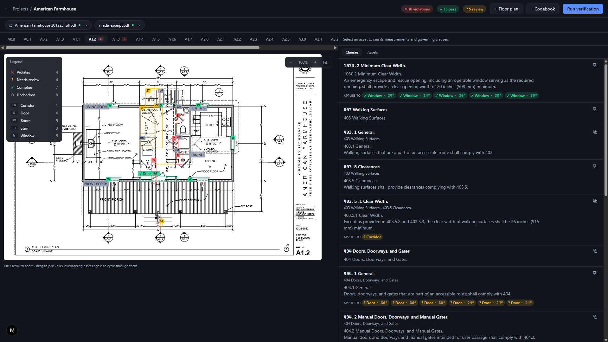

# PlanLint

**A compliance linter for building drawings — that refuses to guess.** PlanLint
reads floor-plan PDFs to find the physical objects, reads codebook PDFs to find
the legal constraints, and verifies one against the other — writing every verdict
as a deterministic, auditable edge in a Neo4j graph:

```
(:PhysicalAsset {id: "D2", type: "door"})
    -[:VIOLATES {measured: 30, required: ">= 32 in",
                 reason: "clear_width is 30 inches, code requires 32 inches minimum"}]->
(:Regulation {clause: "ADA 404.2.3"})
```

A dual-pane web viewer renders the plan with green / red / amber overlays; click a
red box and the exact failing clause scrolls into view beside it.



---

## What PlanLint is — and is not

**It is** an AEC (architecture / engineering / construction) compliance *linter*:
it checks measurable facts on a floor plan against measurable requirements in a
building code, and shows its work. Like a code linter, it flags what it can prove
and leaves the rest for a human.

**It is not** a replacement for a licensed design professional's judgment or a
municipal authority's approval. It does not certify a building as code-compliant.
A `COMPLIES_WITH` edge means *one measurable clause checked out for one measured
asset* — nothing more. Qualitative requirements, undetected geometry, and
anything the tool cannot ground are surfaced as `NEEDS_REVIEW`, not passed.

---

## The one commitment: no LLM ever decides compliance

This is the architectural line the entire design protects, and it is the reason
to use PlanLint over a "just ask GPT if this plan is compliant" prototype.

> **LLMs extract *structure only*. A pure-Python checker is the sole verdict
> authority. Every magnitude is grounded in geometry or printed text before it
> can enter a verdict.**

Concretely:

- The vision model **classifies** entities on a drawing (this is a door, that is a
  room) and reads printed tags. It never reports a *measurement*.
- The text model turns clause prose into a typed `Constraint` (`clear_width >= 32
  in`). Its output is validated — implausible values are bounced back to the model
  via `ModelRetry` before they can enter the pipeline.
- Every number that reaches a verdict is **grounded**: a door's width comes from
  snapped vector geometry, a printed dimension line, or a schedule table — never
  from the model's imagination.
- `verify/checker.py` — plain Python — does the comparison. It is the only place
  a `COMPLIES_WITH` / `VIOLATES` / `NEEDS_REVIEW` is decided.

**Why this matters for a compliance tool:** an LLM asked "is this compliant?" will
answer fluently and sometimes wrongly, with no way to audit *why*. PlanLint's
answer is a graph edge carrying the measured value, the required value, the
clause, and the run id. You can query it, diff it across revisions, and trace
every verdict back to a pixel or a printed number. A confident wrong answer is the
worst failure mode for code review; PlanLint is built so it structurally cannot
produce one.

---

## Honesty is the feature

PlanLint is, today, **stronger at refusing to lie than at measuring everything.**
That is a deliberate trade, and the right one for compliance: a missed check a
human can catch is far cheaper than a fabricated "pass" a human trusts. Here is
the candid picture.

### ✅ What works well
- **Deterministic verdicts and audit trail.** Every verdict is a reproducible,
  queryable graph edge with provenance. Re-runs are idempotent; prior runs stay
  as history.
- **Openings against a schedule.** When a set has a door/window schedule, PlanLint
  builds a document-level index and joins each opening to its size by the plan
  callout (`Ⓒ → 24"`, `① → 30"`) — reliable, and independent of fuzzy gap
  measurement.
- **Openings grounded in geometry.** On vector PDFs, VLM boxes are snapped to real
  CAD primitives and door/window widths are read from the actual wall gap or a
  validated dimension line.
- **Codebook structure.** Clause hierarchy, cross-references, and clause↔asset
  matching are handled deterministically; extracted constraints are cached in the
  graph so re-verification re-runs zero extractions.
- **It says "I don't know" correctly.** Missing scale, unreadable geometry, or a
  qualitative clause reliably becomes `NEEDS_REVIEW`.

### 🟠 What returns NEEDS_REVIEW (by design, today)
- **Most room dimensions.** Residential plans dimension rooms as *chained*
  strings (`6'-6" + 5'-6" + 3'-4" …`). PlanLint does not yet **sum chained
  dimensions**, so a room whose size isn't a single span or a printed area comes
  back `NEEDS_REVIEW` rather than a wrong number. (This is the top item on the
  roadmap.)
- **Anything with no detected scale.** Every dimensional check depends on reading
  the drawing scale; without it, measurements are withheld.
- **Qualitative clauses.** "Adequate", "as required by the AHJ", and similar are
  not machine-checkable and are never auto-passed.

### ⚠️ Known limitations (read before trusting output)
- **Schedule sizes are nominal, not clear width.** A "36-inch" door leaf yields
  roughly 34" of clear opening; PlanLint currently records the nominal figure.
  Better than a wrong gap measurement, but not the true clear dimension.
- **Raster / scanned plans are the weakest path.** They rely on OpenCV wall-masks
  and OCR — no dimension-grid, no schedule-text parsing. Expect materially lower
  fidelity than on vector PDFs.
- **VLM classification is imperfect.** The *set* of detected assets originates
  from a vision model. It miscounts and misclassifies (hatched wall piers can read
  as windows; garage doors can be missed on scans). Geometry snapping catches much
  of this, but not all — a stronger vision model meaningfully improves detection.
- **Feet-only callouts are ignored.** A bare `9'` (no inch mark) is not yet parsed
  as a dimension.
- **Generalization is unproven.** The geometry work is validated against one real
  multi-sheet set plus synthetic fixtures. Different firms' dimensioning styles,
  callout conventions, and layer discipline will surface new edge cases.

If you are evaluating PlanLint: judge it on the *discipline* — the seam between
extraction and verdict, the grounding, the honest `NEEDS_REVIEW` — not on a raw
accuracy number. The accuracy will climb; the discipline is the design.

---

## Architecture

Verification is a pipeline (`verify/pipeline.py`), each stage in its own module,
each page and asset isolated so one bad input never aborts a run. For the full
module-by-module reference, see [`ARCHITECTURE.md`](ARCHITECTURE.md).

```
 floor plan PDF ──► spatial ingestion ──► (:PhysicalAsset) ─┐
   PyMuPDF vector geometry + OpenCV raster masks,           │   4-stage verification
   VLM classifies, geometry/schedules measure               ├─► Code Hunter    (vector search + clause ancestry)
                                                             │   Rule Extractor (LLM → typed Constraint, validated)
 codebook PDF ───► semantic ingestion ───► (:Regulation) ───┘   Checker        (pure Python — the sole verdict)
   LLM-first transcription / Docling, clause                    Compiler       (Cypher MERGE, idempotent per run)
   hierarchy preserved, embeddings in Neo4j
```

**1. Spatial ingestion** (`ingest/spatial.py`) — each page of a drawing set is
classified by its title block (`ingest/sheet_type.py`) and routed: floor plans run
the plan-view detector, schedules are mined for opening sizes, elevations/sections
run a vertical-dimension detector, everything else is recorded but not linted.
A document-level pass builds one **schedule index** first, so an opening's callout
can be joined to its printed size no matter which sheet the schedule lives on.

**2. Semantic ingestion** (`ingest/semantic.py`) — codebook PDF → a `Regulation`
clause tree. The parser is LLM-first (a vision transcriber whose output is
cross-checked against the page text layer, so a flipped `32"→36"` is caught and
bounced), with Docling as an offline/no-key fallback and a regex clause-tree
parser for header-less documents.

**3. Code Hunter** (`verify/code_hunter.py`) — for each asset, vector search over
clause embeddings plus a walk up the `PARENT_OF` ancestry to recover full clause
context.

**4. Rule Extractor** (`verify/rule_extractor.py`) — the LLM turns matched clause
prose into a typed, validated `Constraint`. **Extracted constraints are cached as
first-class graph nodes — the graph is the cache** — so re-verifying a revised
plan against an unchanged codebook re-runs zero extractions.

**5. Checker** (`verify/checker.py`) — pure Python compares measurement vs.
constraint and produces the verdict.

### Grounding techniques (how a number earns the right to be checked)

- **Geometry snapping** — VLM boxes are snapped to underlying vector primitives;
  door/window openings are grounded in the real wall gap (`classify_opening_vector`,
  a tri-state that *refutes* a claimed opening filled by hatching/fill).
- **Dimension-line grounding** (`ingest/dimensions.py`) — a printed dimension is
  trusted only when its value matches the length of the dimension line it sits on
  (`value ≈ span × scale`). Architectural dimensions live on lines *outside* the
  element, so this both validates the number and locates which asset it measures.
- **Callout → schedule join** — opening size comes from the door/window schedule,
  keyed by the plan callout (kind-restricted and proximity-bound so a section
  marker can't pose as a window tag).
- **Text-layer cross-checks** — a transcribed codebook dimension, or a printed
  floor area, is only accepted when it actually appears in the page's text layer.
- **Structural-note rejection** — a number inside a note (`2X12 JOISTS @ 16" OC`)
  is never read as a clear width.

### Provenance-based confidence

Every asset carries a confidence tier by *how it was measured*, so the UI and any
consumer can weight a `vlm-only` guess differently from snapped geometry:

| Provenance | Confidence | Meaning |
|---|---|---|
| `schedule` | 0.95 | joined to a printed schedule size |
| `vector-snapped` | 0.95 | box snapped to real CAD geometry |
| `raster-snapped` | 0.80 | box snapped to pixel wall-mask |
| `vlm-only` | 0.60 | model box, not confirmed by geometry — warrants a look |

### Graph schema

```
(:Project)-[:HAS_DOCUMENT]->(:Document)-[:HAS_SHEET]->(:Sheet)-[:CONTAINS]->(:PhysicalAsset)
(:Document)-[:HAS_CLAUSE]->(:Regulation)-[:PARENT_OF]->(:Regulation)   // clause hierarchy
(:Regulation)-[:DEFINES]->(:Constraint)                                // cached extraction
(:PhysicalAsset)-[:COMPLIES_WITH|VIOLATES|NEEDS_REVIEW {run_id, measured, required, reason}]->(:Regulation)
```

Verdict edges are `MERGE`d on `(asset, regulation, run_id)` — re-runs are
idempotent and prior runs remain queryable as audit history. Explore the graph at
http://localhost:7474 (Neo4j Browser).

---

## Quickstart (5 minutes)

```bash
git clone https://github.com/luckmanqasim/planlint.git && cd planlint
cp .env.example .env        # add your OPENAI_API_KEY (or Google / Anthropic — see .env)
docker compose up --build
```

Open http://localhost:3000, click **Load sample project**, then **Run
verification**.

The bundled sample is a vector floor plan with three interior doors and a fire
exit, checked against the bundled code excerpt (public-domain 2010 ADA text plus
a short illustrative egress clause):

- **D1 — 36"** → `COMPLIES_WITH` ADA 404.2.3 (32" minimum)
- **D2 — 30"** → **`VIOLATES`** ADA 404.2.3 (30 < 32)
- **D3 — 32"** → `COMPLIES_WITH` (exact boundary case)

Click the red **D2** box and its failing clause scrolls into view beside the plan.


### No API key? Run it fully offline

```bash
# in .env
PLANLINT_OFFLINE_SAMPLE=1
```

This replaces every LLM call with deterministic stand-ins (a label reader parses
the CAD text, a regex extractor reads the clause), so the bundled sample runs
end-to-end with **zero API cost and no network** — ideal for a first look or CI.
It is a demo/dev mode only; never use it on real projects.

---

## Bring your own codebook

NFPA and ICC / IBC codebooks are **copyrighted and are not bundled.** Upload any
codebook PDF you are licensed to use — the ingestion pipeline is
codebook-agnostic. The 2010 ADA Standards ship as the working sample precisely
because they are a **US-government work in the public domain** (the sample adds
one short *illustrative* egress clause, in our own wording, so a window check can
be demonstrated — ADA does not size windows).

For real codebooks (multi-column layouts, nested tables) without a vision API key,
install the Docling parser backend:

```bash
cd backend && uv sync --extra docling
```

---

## Configuration

| Env var | Default (`.env.example`) | Purpose |
|---|---|---|
| `PLANLINT_VISION_MODEL` | `openai:gpt-5.6-sol` | VLM for entity classification (any Pydantic AI model string) |
| `PLANLINT_TEXT_MODEL` | `openai:gpt-5.6-sol` | Constraint extraction model |
| `PLANLINT_SEMANTIC_PARSER` | `auto` | `auto` \| `docling` \| `simple` \| `llm` |
| `NEO4J_URI` / `NEO4J_USER` / `NEO4J_PASSWORD` | localhost | Graph database |
| `PLANLINT_OFFLINE_SAMPLE` | `0` | Deterministic offline mode (demo/dev only) |

Detection quality is bounded by the vision model: a stronger vision model reads
hatched wall piers and garage doors more reliably than a lightweight one.
Embeddings are local (fastembed ONNX, 384-dim bge-small) — no API cost, works
offline.

---

## Contributing

Building from source, running the test suite, or contributing changes? See
[`CONTRIBUTING.md`](CONTRIBUTING.md) for dev setup and the project's test
discipline, and [`ARCHITECTURE.md`](ARCHITECTURE.md) for a module-by-module tour
of the codebase.

---

## License

Apache-2.0 (see [`LICENSE`](LICENSE)). The bundled code excerpt is verbatim 2010
ADA Standards text (a US-government work in the public domain); the one short
egress clause is original illustrative content under this repo's Apache-2.0 — not
copied from any copyrighted code. Real NFPA / ICC codebooks are copyrighted and
are deliberately not included — bring your own licensed copy.

PlanLint assists compliance review; it does not replace a licensed professional's
judgment or a municipal authority's approval.
